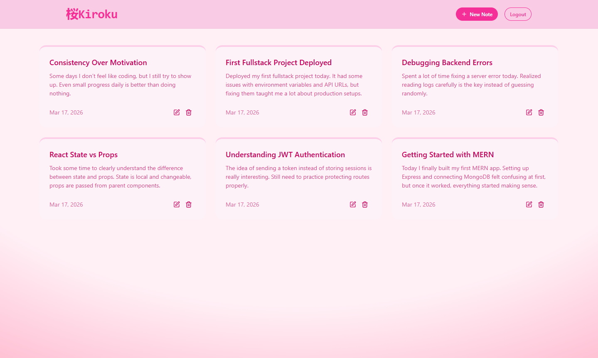
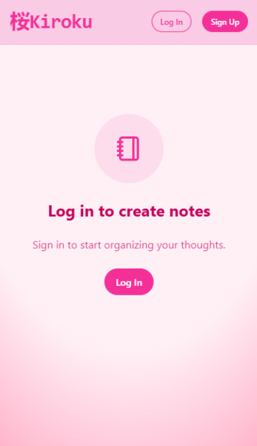
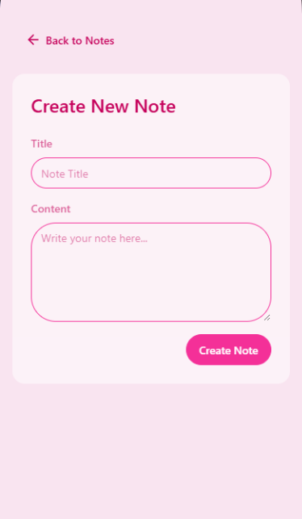
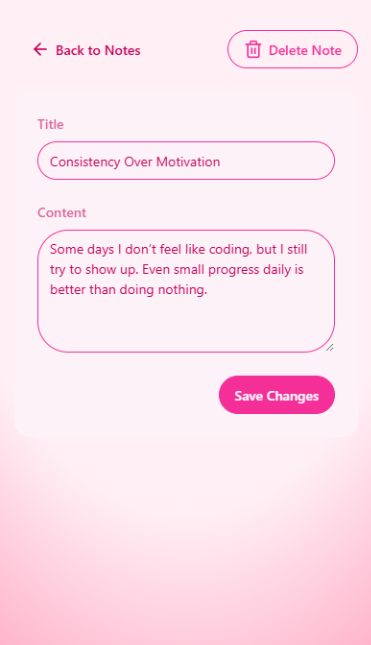
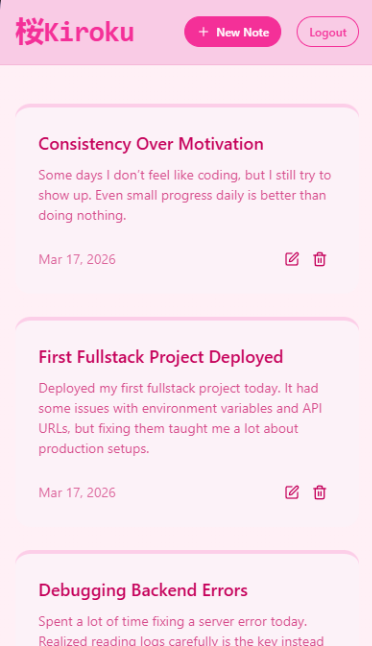

# 📝 Note App (MERN + JWT Auth)
A simple full-stack note-taking application with authentication.
Users can securely create, update, and delete notes after logging in.
# 📸 Preview

 
 

# 🚀 Features
- 🔐 JWT-based authentication (login & protected routes)
- 📝 Create, update, and delete notes
- 👤 User-specific notes (only accessible after login)
- ⚡ Responsive UI

# 🛠️ Tech Stack
- Frontend: React, JavaScript / TypeScript, Tailwind CSS
- Backend: Node.js, Express
- Database: MongoDB
- Auth: JSON Web Tokens (JWT)
